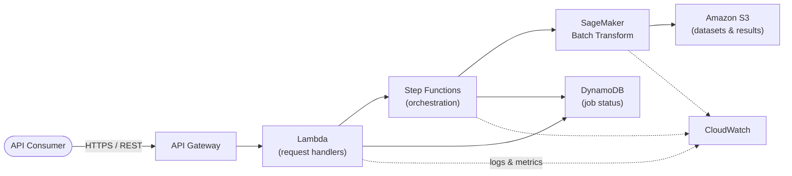

# Batch Inference Platform

A serverless, production-oriented reference platform for asynchronous ML
batch inference on AWS: upload a dataset, submit an inference job, track its
progress, and retrieve predictions -- all on managed, pay-per-use AWS
services with near-zero idle cost.

The platform is built and maintained the way an internal infrastructure
team would run it: infrastructure as code, architecture decisions recorded
as they're made, least-privilege IAM throughout, and a delivery model where
every change lands as a reviewable, independently functional increment.

The ML model behind the API is intentionally simple -- a `scikit-learn`
classifier trained on the Iris dataset. The point of this repository is the
platform around the model: how a batch inference request is accepted,
orchestrated, executed, observed, and made reliable in production, not
model sophistication.

## Architecture at a glance



Client → API Gateway → Lambda → Step Functions → Batch Inference Job → S3 →
Status Update → DynamoDB → Result Retrieval API.

Job submission is **asynchronous**: `POST /jobs` returns a `job_id`
immediately, clients poll for status, and retrieve results once complete.
This is a deliberate design choice, not a limitation -- see
[ADR-0008](docs/adr/0008-asynchronous-job-processing-pattern.md).

Full system context, container, and component diagrams, the data model, and
the Well-Architected Framework mapping live in
[`docs/architecture/overview.md`](docs/architecture/overview.md). Every
individual request/job flow is diagrammed in
[`docs/architecture/sequence-diagrams.md`](docs/architecture/sequence-diagrams.md).

## Why this architecture

| Decision                                          | Rationale (full reasoning in the linked ADR)                     |
| ---------------------------------------------------- | ---------------------------------------------------------------------- |
| Serverless-only: no EC2, ECS, EKS, or Aurora            | [ADR-0002](docs/adr/0002-serverless-first-architecture.md) -- near-zero idle cost, matches bursty batch workload shape |
| SageMaker Batch Transform, not Processing               | [ADR-0003](docs/adr/0003-sagemaker-batch-transform-vs-processing.md) -- purpose-built for batch inference, native `.sync` Step Functions integration |
| Step Functions for orchestration                        | [ADR-0004](docs/adr/0004-step-functions-for-orchestration.md) -- no Lambda polling loops, built-in retry/catch, full execution visibility |
| DynamoDB single-table, on-demand, with TTL               | [ADR-0005](docs/adr/0005-dynamodb-single-table-job-state.md) -- matches the platform's one real access pattern, zero capacity planning |
| API Gateway REST API, not HTTP API                       | [ADR-0006](docs/adr/0006-api-gateway-rest-api-choice.md) -- request validation, usage plans, WAF and private-endpoint support |
| Shared code as a Lambda Layer                            | [ADR-0007](docs/adr/0007-lambda-layers-shared-code.md) -- one source of truth for domain/infrastructure code across functions |
| Asynchronous submit-and-poll, not synchronous inference    | [ADR-0008](docs/adr/0008-asynchronous-job-processing-pattern.md) -- API Gateway's 29s integration timeout makes synchronous batch inference structurally impossible |

## Technology stack

| Layer              | Technology                                            |
| -------------------- | ---------------------------------------------------------- |
| Language              | Python 3.12                                                |
| Infrastructure as Code | AWS SAM                                                    |
| API                    | Amazon API Gateway (REST API)                              |
| Compute                | AWS Lambda                                                 |
| Orchestration          | AWS Step Functions                                          |
| ML execution           | Amazon SageMaker Batch Transform                            |
| Storage                | Amazon S3                                                   |
| Job state               | Amazon DynamoDB                                             |
| Observability           | Amazon CloudWatch (Logs, Metrics, Alarms, Dashboards)        |
| Access control           | AWS IAM (least privilege, per-function roles)               |
| CI/CD                    | GitHub Actions (Phase 4)                                    |
| Testing                   | pytest, moto                                                |
| Code quality               | Ruff, Black, mypy (strict), pre-commit                      |

## Repository structure

```
├── src/batch_inference_platform/   # Application code (Clean Architecture layers)
│   ├── api/                          # Lambda handlers (interface layer)
│   ├── application/                  # Use cases and DTOs
│   ├── domain/                        # Entities, value objects, ports, exceptions
│   ├── infrastructure/                 # AWS adapters (DynamoDB, S3, Step Functions, SageMaker)
│   └── shared/                          # Logging, configuration, cross-cutting concerns
├── tests/                            # Unit and integration tests (moto-mocked AWS)
├── ml/                                # Model training script and packaging (Iris classifier)
├── scripts/                           # Deployment and operational helper scripts
├── docs/
│   ├── architecture/                    # Overview + sequence diagrams
│   ├── adr/                              # Architecture Decision Records
│   ├── standards/                         # Naming conventions, coding standards
│   ├── guides/                             # Development, deployment, cost, security guides
│   └── roadmap.md                          # Phased delivery plan
├── template.yaml                       # AWS SAM template (Phase 2)
├── pyproject.toml                      # Project metadata, Ruff/Black/mypy/pytest config
└── Makefile                            # Common developer commands
```

## Getting started

```bash
git clone <repo-url> && cd aws-mlops-reference-platform
make install         # create venv, install package + dev dependencies
make install-hooks   # install pre-commit git hooks
make test            # run the test suite
```

Full setup instructions, troubleshooting, and the local AWS-mocking
approach (`moto`) are in the
[development environment guide](docs/guides/development-environment.md).
Deployment instructions land with the SAM template in Phase 2; the
deployment model itself is documented now in the
[deployment strategy guide](docs/guides/deployment-strategy.md).

## Documentation

Start at the [documentation index](docs/README.md) for the full map. Key
entry points:

- [Architecture overview](docs/architecture/overview.md)
- [Sequence diagrams](docs/architecture/sequence-diagrams.md)
- [Architecture Decision Records](docs/adr/README.md)
- [Naming conventions](docs/standards/naming-conventions.md) ·
  [Coding standards](docs/standards/coding-standards.md)
- [Development environment](docs/guides/development-environment.md) ·
  [Deployment strategy](docs/guides/deployment-strategy.md)
- [Project roadmap](docs/roadmap.md)

## Design principles

This platform is built against the AWS Well-Architected Framework and the
AWS Machine Learning Lens; the detailed mapping of each pillar to concrete
architectural choices is in
[`docs/architecture/overview.md`](docs/architecture/overview.md#aws-well-architected-framework-mapping).
Beyond the AWS-specific frameworks, the codebase follows Clean Architecture
layering, SOLID principles, and 12-factor configuration -- detailed in the
[coding standards](docs/standards/coding-standards.md).

## Delivery model

This repository is built incrementally: each phase is scoped to be a
complete, independently functional, mergeable unit of work, tagged as a
release once complete. See the [roadmap](docs/roadmap.md) for the full
phase plan and what's deferred beyond it.

| Phase | Scope                                     | Status         |
| ----- | -------------------------------------------- | ------------------ |
| 1     | Repository foundation, architecture, docs      | In progress       |
| 2     | Infrastructure as Code (AWS SAM)                | Not started       |
| 3     | Application implementation                       | Not started       |
| 4     | Enterprise production readiness (CI/CD, observability, security review) | Not started |

## License

[MIT](LICENSE)
