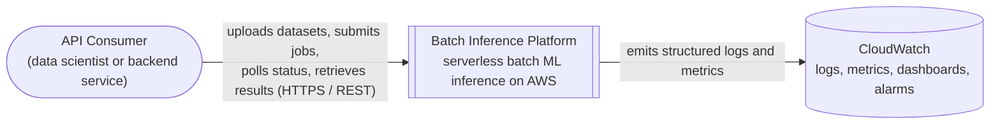
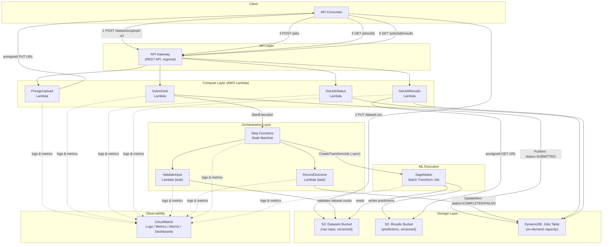
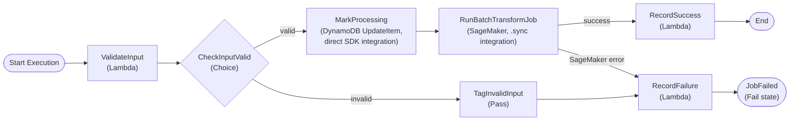
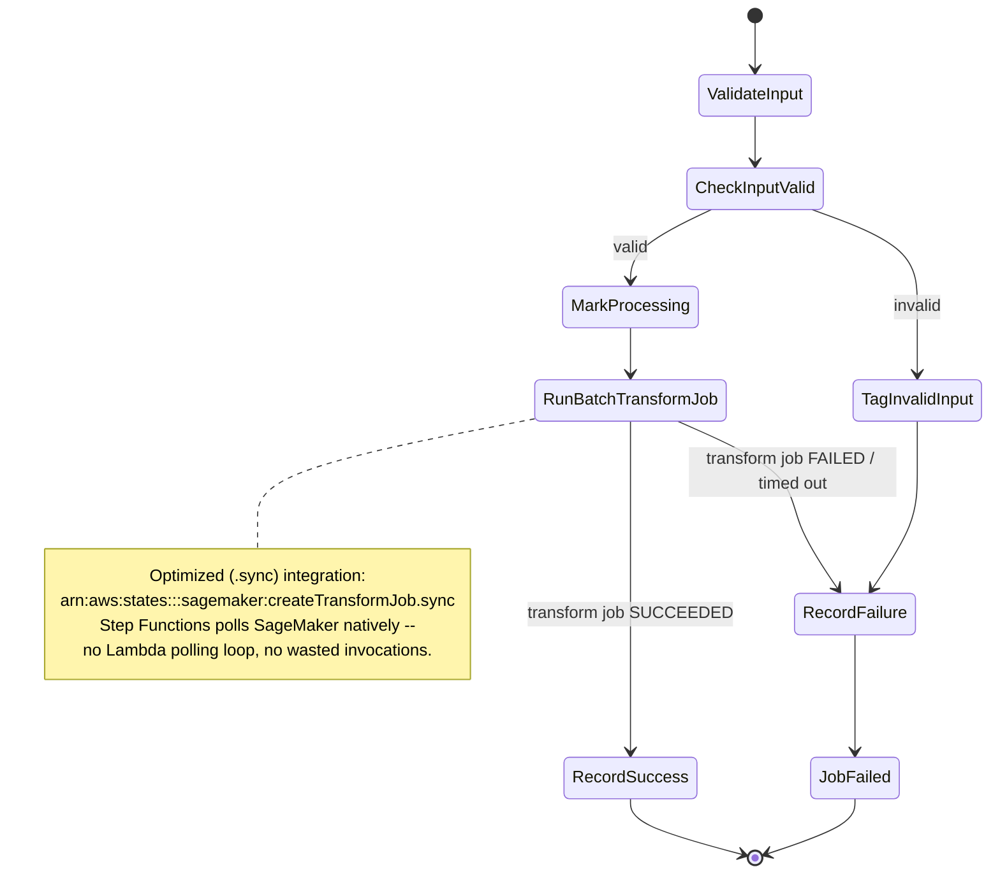

# Architecture Overview

This document describes the system architecture of the Batch Inference
Platform: a serverless reference implementation for submitting datasets,
running asynchronous ML batch inference, and retrieving predictions on AWS.

For step-by-step interaction flows, see
[`sequence-diagrams.md`](sequence-diagrams.md). For the reasoning behind
individual decisions, see the [ADR log](../adr/README.md).

## Scope and non-goals

This platform demonstrates **operational and architectural maturity** for
running batch ML inference in production. It intentionally uses a simple,
pre-trained `scikit-learn` model (Iris classification) as the payload. The
following are explicitly out of scope:

- Model training pipelines, experiment tracking, and feature stores.
- Real-time / low-latency inference (this is a batch system by design).
- Multi-tenant isolation beyond IAM-level resource scoping.

## Guiding constraints

| Constraint                        | Implication                                                                 |
| ----------------------------------- | ------------------------------------------------------------------------------ |
| Serverless-first, near-zero idle cost | No EC2, ECS, EKS, or Aurora. Every compute resource scales to zero and bills per invocation/second. |
| Asynchronous by design               | API Gateway has a hard 29-second integration timeout; batch inference can run for minutes. All job submission is fire-and-poll, never synchronous request/response. See [ADR-0008](../adr/0008-asynchronous-job-processing-pattern.md). |
| Least privilege                      | Every Lambda function and state machine task has a dedicated IAM role scoped to the exact resources and actions it needs -- no shared "execution role" for the whole stack. |
| Observability by default             | Structured JSON logs, correlation IDs (`job_id`) propagated across every hop, and CloudWatch alarms on the failure paths that matter operationally. |

## System context (C4 Level 1)



## Container view (C4 Level 2)



**Key design point:** the client never receives inference results directly
from API Gateway. `SubmitJob` returns a `job_id` immediately (HTTP 202); the
client polls `GetJobStatus` and, once `COMPLETED`, calls `GetJobResults` to
receive a presigned S3 URL. This keeps every API Gateway integration well
under its timeout regardless of dataset size or model runtime.

## Component view: Job Orchestration



Every path -- valid, invalid, or a failed transform job -- reaches exactly
one of two Lambda-backed terminal states, `RecordSuccess` or `RecordFailure`,
so no execution can end without a corresponding DynamoDB status write and
CloudWatch EMF metric. The exact ASL is in
[`statemachine/job_orchestration.asl.json`](../../statemachine/job_orchestration.asl.json).

## Step Functions state machine (logical states)



This ASL definition ships as `statemachine/job_orchestration.asl.json` as of
**Phase 2** (infrastructure only -- `ValidateInput` and `RecordSuccess`/
`RecordFailure` are placeholder Lambda handlers until Phase 3).

## Data model summary

### DynamoDB -- `Jobs` table

Single-table design, on-demand billing (no idle cost, scales automatically).

| Attribute       | Type   | Notes                                                        |
| ---------------- | ------ | ------------------------------------------------------------- |
| `job_id` (PK)     | String | ULID, sortable by creation time, generated at submission.     |
| `status`          | String | `SUBMITTED` \| `PROCESSING` \| `COMPLETED` \| `FAILED`         |
| `input_s3_key`    | String | Key of the uploaded dataset in the datasets bucket.            |
| `output_s3_key`   | String | Key of the prediction output, populated on completion.         |
| `error_message`   | String | Populated only when `status = FAILED`.                         |
| `created_at`      | String | ISO-8601 UTC timestamp.                                        |
| `updated_at`      | String | ISO-8601 UTC timestamp, updated on every state transition.     |
| `ttl`             | Number | Unix epoch; job records expire automatically after 30 days.    |

Rationale for a single table with no GSIs in the initial design is captured in
[ADR-0005](../adr/0005-dynamodb-single-table-job-state.md).

### S3 layout

```
s3://<datasets-bucket>/uploads/{job_id}/input.csv
s3://<results-bucket>/predictions/{job_id}/input.csv.out
s3://<model-artifacts-bucket>/model/model.tar.gz
```

A third bucket, for the packaged SageMaker model artifact, was added when
Phase 2 implemented the infrastructure -- model artifacts have a distinct
lifecycle (long-lived, versioned by model release) from transient job I/O,
so they don't belong in the datasets or results buckets. All three buckets
are versioned, encrypted with SSE-S3 (default) or SSE-KMS
(configurable via [ADR-0010](../adr/0010-optional-customer-managed-kms-key.md)),
block all public access, and enforce TLS-only access via bucket policy.
Lifecycle rules expire objects in the datasets and results buckets after a
configurable retention window (defaults: 7 and 30 days respectively) to
bound storage cost; the model artifacts bucket has no expiration on current
versions, only a bound on how many noncurrent (superseded) versions persist.

## API surface (contract; infrastructure deployed in Phase 2, behavior implemented in Phase 3)

| Method | Path                    | Purpose                                                  |
| ------ | ------------------------ | ----------------------------------------------------------- |
| POST   | `/datasets/upload-url`     | Returns a presigned S3 PUT URL for uploading a dataset.       |
| POST   | `/jobs`                    | Submits a batch inference job referencing an uploaded dataset. Returns `202 Accepted` with a `job_id`. |
| GET    | `/jobs/{jobId}`             | Returns current job status and timestamps.                   |
| GET    | `/jobs/{jobId}/results`     | Returns a presigned S3 GET URL once the job is `COMPLETED`.    |

Request/response schemas are enforced with API Gateway request validation
models (JSON Schema) -- rejecting malformed input at the edge, before it
reaches Lambda. See [ADR-0006](../adr/0006-api-gateway-rest-api-choice.md).

## AWS Well-Architected Framework mapping

| Pillar                    | How this platform addresses it                                                                 |
| --------------------------- | -------------------------------------------------------------------------------------------------- |
| Operational Excellence        | IaC via AWS SAM, structured logging, CloudWatch dashboards, runbooks, ADRs capturing decision history. |
| Security                      | Least-privilege per-function IAM roles, S3 Block Public Access, encryption at rest/in transit, no long-lived credentials, input validation at the API edge. |
| Reliability                   | Step Functions retries/catch blocks, DynamoDB on-demand (no capacity planning), S3 durability (11 nines), idempotent job submission via client-supplied or generated `job_id`. |
| Performance Efficiency        | Serverless compute scales automatically with load; SageMaker Batch Transform scales instance count to dataset size without manual tuning. |
| Cost Optimization              | Pay-per-use across every layer; S3 lifecycle rules; DynamoDB TTL; CloudWatch log retention limits; no idle compute. See the [cost guide](../guides/cost-guide.md) (Phase 4). |
| Sustainability                 | Right-sized, ephemeral compute avoids over-provisioned always-on infrastructure. |

### AWS ML Lens considerations

- **Reproducibility:** model artifact is versioned in S3 and referenced by
  URI/ETag, never mutated in place.
- **Separation of concerns:** training (offline, `ml/`) is decoupled from
  serving (SageMaker Batch Transform), matching the ML Lens guidance to treat
  model artifacts as immutable build outputs.
- **Human-in-the-loop readiness:** job status model has room for a future
  `REVIEW_REQUIRED` state without a breaking schema change.

## Related documents

- [Sequence diagrams](sequence-diagrams.md)
- [ADR log](../adr/README.md)
- [Naming conventions](../standards/naming-conventions.md)
- [Deployment strategy](../guides/deployment-strategy.md) ·
  [Deployment guide](../guides/deployment-guide.md)
- [Project roadmap](../roadmap.md)
- [`template.yaml`](../../template.yaml) ·
  [`statemachine/job_orchestration.asl.json`](../../statemachine/job_orchestration.asl.json)
