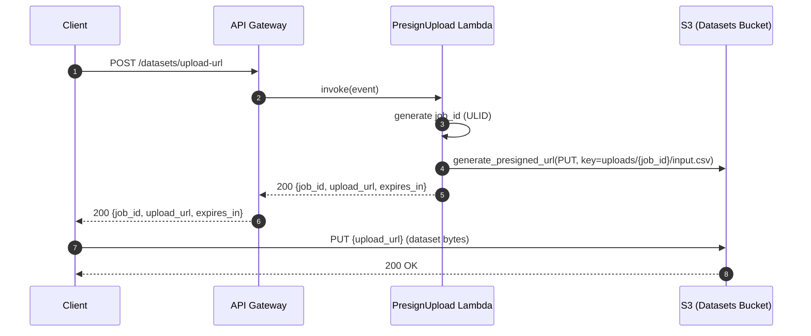
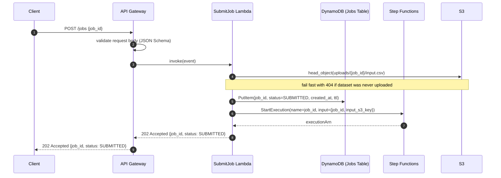
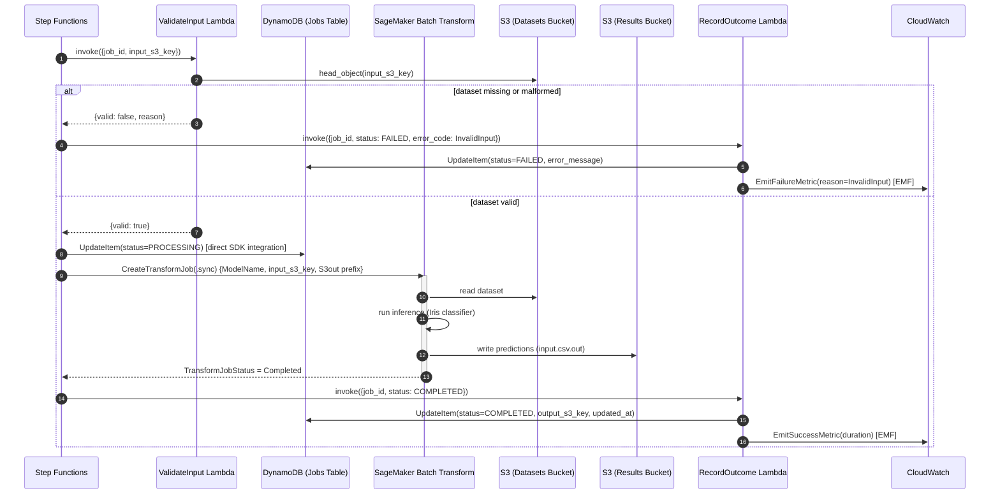
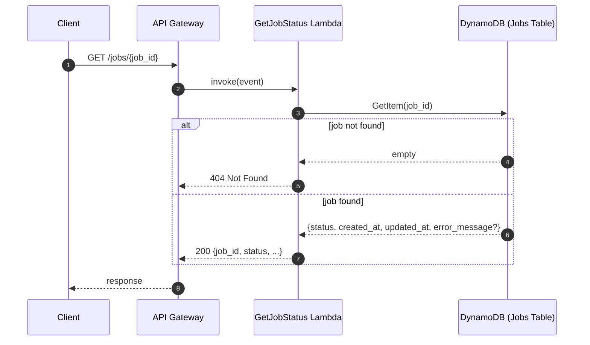
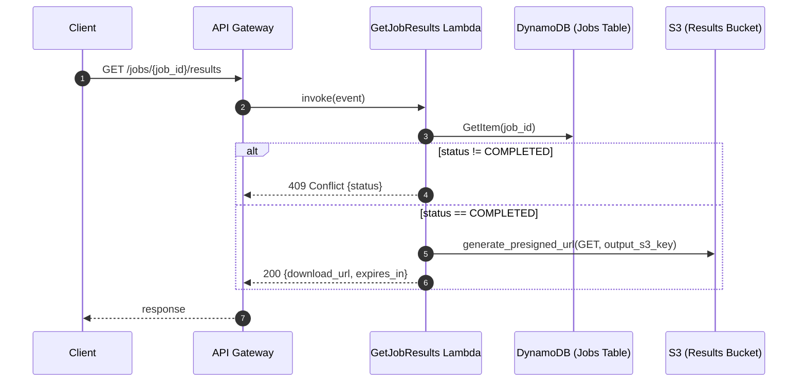
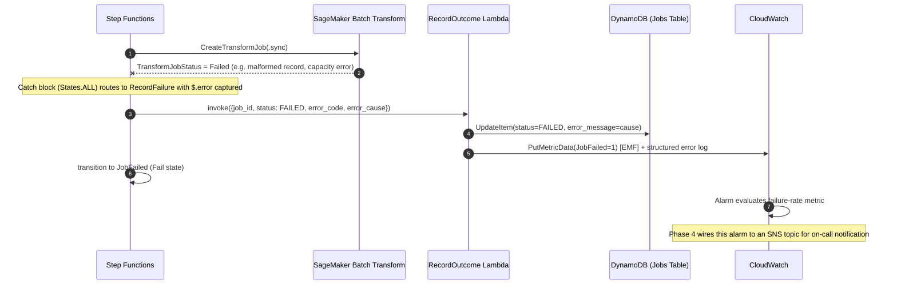

# Sequence Diagrams

Detailed interaction flows for every stage of the batch inference lifecycle.
See [`overview.md`](overview.md) for the static architecture these flows
operate on.

## 1. Dataset upload

The client never uploads directly through API Gateway/Lambda (avoiding
payload-size limits and unnecessary compute cost); it uploads straight to S3
using a short-lived presigned URL.

## 2. Batch job submission

`job_id` is used as both the DynamoDB partition key and the Step Functions
execution name, giving the whole system a single, greppable correlation ID
end-to-end -- through CloudWatch Logs, X-Ray traces, and the Step Functions
console.

## 3. State machine orchestration (batch inference execution)

The `.sync` service integration (`arn:aws:states:::sagemaker:createTransformJob.sync`)
means Step Functions itself waits on the SageMaker job, with no Lambda
polling loop burning invocations while inference runs.

## 4. Job status check

Clients are expected to poll with backoff (see the
[deployment strategy guide](../guides/deployment-strategy.md) for recommended
polling intervals) until `status` is `COMPLETED` or `FAILED`.

## 5. Result retrieval

## 6. Failure handling

Every failure path writes a terminal `FAILED` state to DynamoDB -- there is no
way for a job to be left in `PROCESSING` indefinitely. Step Functions'
built-in `Retry` (transient errors) and `Catch` (terminal errors) blocks
implement this guarantee; see
[ADR-0004](../adr/0004-step-functions-for-orchestration.md).
