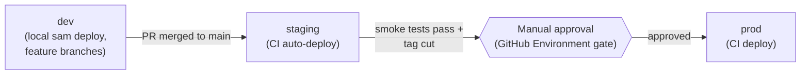

# Deployment Strategy

This document defines *how* this platform is deployed and promoted across
environments. It is a strategy document, written before any infrastructure
exists, so that the SAM template built in **Phase 2** is designed against a
deliberate deployment model rather than growing one organically. Concrete,
copy-pasteable deployment commands are added alongside the SAM template
itself in Phase 2.

## Infrastructure as Code

All infrastructure is defined in a single **AWS SAM** template
(`template.yaml`), deployed exclusively via the `sam` CLI (locally by
developers pre-CI, and via GitHub Actions in Phase 4). There is no
console-driven ("ClickOps") resource creation for anything this platform
owns -- any resource not defined in the template is not considered part of
the system and is expected to be deleted during environment cleanup.

## Environments

| Environment | Purpose                                             | Deployed from                     | Approval          |
| ------------ | ------------------------------------------------------ | ------------------------------------ | -------------------- |
| `dev`         | Individual developer / feature validation                | Local `sam deploy` from a feature branch | None -- self-service |
| `staging`     | Pre-production validation against the `main` branch tip | CI, on merge to `main`                | Automatic            |
| `prod`        | Production                                              | CI, on tagged release                 | Manual approval gate (GitHub Environments protection rule, Phase 4) |

Each environment is a **fully independent CloudFormation stack**
(`batch-inference-{environment}`), parameterized by an `Environment`
template parameter that drives resource naming (per the
[naming conventions](../standards/naming-conventions.md)), log retention,
and removal policies. No environment shares a physical resource (bucket,
table, or role) with another -- this is what makes `dev` stacks safe to
tear down and recreate on a whim.

## Stack parameterization

The SAM template (Phase 2) exposes parameters rather than hard-coding
environment-specific values:

| Parameter            | `dev` default | `staging`/`prod`                       |
| ---------------------- | --------------- | ------------------------------------------ |
| `Environment`           | `dev`          | `staging` / `prod`                        |
| `LogRetentionInDays`     | `14`           | `90` (staging), `365` (prod)               |
| `DatasetRetentionDays`   | `7`            | `30`                                       |
| `TransformInstanceType`   | `ml.m5.large`  | `ml.m5.large` (tunable without a template change) |

This keeps a single template as the source of truth for all environments --
divergence between `dev` and `prod` is a parameter value, never a forked
template.

## Deployment mechanics

- **Build:** `sam build` (containerized, `--use-container`) ensures Lambda
  packaging happens in an environment matching the actual Lambda runtime,
  avoiding "works locally, fails in Lambda" native-dependency mismatches.
- **Deploy:** `sam deploy` with a per-environment `samconfig.toml` config
  environment (`sam deploy --config-env dev`), never with inline
  interactive prompts in CI.
- **Changesets:** every deploy generates and can be reviewed as a
  CloudFormation changeset before execution -- `prod` deploys in CI require
  the changeset to be visible in the GitHub Actions run output before the
  manual approval gate unblocks execution.
- **Rollback:** CloudFormation's native automatic rollback-on-failure is
  relied on as the first line of defense; the
  [disaster recovery guide](../runbooks/) (Phase 4) documents manual
  rollback procedures for failure modes CloudFormation can't catch (e.g. a
  bad model artifact deployed successfully but producing wrong predictions).

## Promotion flow

Promotion is **one-directional and artifact-based**: the same built Lambda
package and CloudFormation template that passed staging is what gets
deployed to prod (parameterized differently), never a rebuild from source
at prod-deploy time. This guarantees what was tested in staging is bit-for-
bit what runs in production.

## Client polling guidance

Since job submission is asynchronous (see
[ADR-0008](../adr/0008-asynchronous-job-processing-pattern.md)), API
consumers should poll `GET /jobs/{job_id}` with exponential backoff:

- Initial interval: 2 seconds.
- Backoff multiplier: 1.5x.
- Cap: 30 seconds between polls.
- Give up (and surface an error to the human/operator) after a configurable
  maximum wait, e.g. 15 minutes, since a job stuck in `PROCESSING` past that
  point indicates an operational issue worth alerting on rather than
  continued silent polling.

## Cleanup

Every environment stack must be fully deletable via `sam delete` /
`aws cloudformation delete-stack` with no manual cleanup steps, which
requires S3 buckets in the template to either be empty-on-delete (via a
custom resource, Phase 4) or have lifecycle rules aggressive enough that
`dev` stacks never accumulate meaningful cost between teardown and
recreation. This constraint is designed in now so it isn't a Phase 2
retrofit.

## Related documents

- [Naming conventions](../standards/naming-conventions.md)
- [Architecture overview](../architecture/overview.md)
- Concrete deployment instructions -- added with the SAM template in Phase 2
- [Cost guide](cost-guide.md) and [security guide](security-guide.md) --
  added in Phase 4
