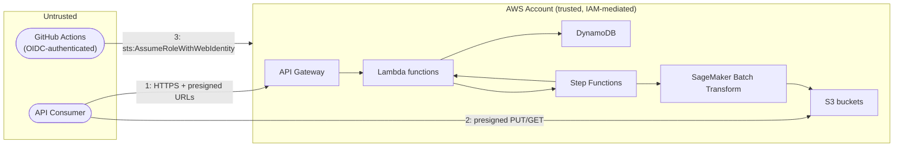

# Threat Model

A STRIDE (Spoofing, Tampering, Repudiation, Information disclosure, Denial
of service, Elevation of privilege) walkthrough of each trust boundary in
the platform. See [`docs/architecture/overview.md`](../architecture/overview.md)
for the system diagrams this analysis refers to.

## Trust boundaries

Boundary 1 and 2 are where an external, unauthenticated-by-default party
first touches the system. Boundary 3 is where an external CI system gains
write access to the AWS account. Everything to the right of those
boundaries is IAM-mediated, least-privilege-scoped AWS-to-AWS traffic.

## 1. Client to API Gateway

| Threat                                    | Mitigation                                                                                 |
| -------------------------------------------- | ------------------------------------------------------------------------------------------------ |
| **Spoofing** a request as another job's owner  | `job_id` is an unguessable 26-character ULID (~128 bits of randomness); there is currently no per-caller authentication/authorization layer -- anyone who knows (or brute-forces) a `job_id` can read its status/results. Acceptable for this reference architecture's scope; a real multi-tenant deployment needs an authorizer (Cognito/IAM/Lambda authorizer) binding `job_id` to a caller identity. Tracked in the [roadmap](../roadmap.md). |
| **Tampering** with a request in transit          | TLS-only (API Gateway has no HTTP listener); request validation models reject a malformed body before Lambda runs (ADR-0006). |
| **Repudiation** -- denying a submission happened   | API Gateway access logs (structured JSON, `requestId` included) plus Lambda structured logs with `job_id` correlation give an audit trail of every request. |
| **Information disclosure** via error messages       | Handlers return typed, minimal error bodies (`{"message": ...}`); domain exception internals (stack traces, AWS SDK error internals) are never serialized into API responses -- see `api/handlers/*.py`. |
| **Denial of service**                                | Stage-level throttling (`ThrottlingBurstLimit`/`ThrottlingRateLimit` in `template.yaml`) caps request rate per API. AWS Shield Standard covers the account by default (no additional configuration). WAF is not currently attached -- noted as a gap below. |
| **Elevation of privilege**                             | Not applicable at this boundary -- the API has no privilege levels (no admin/user distinction) to elevate between. |

## 2. Client to S3 (presigned URLs)

| Threat                                       | Mitigation                                                                     |
| ----------------------------------------------- | ------------------------------------------------------------------------------------ |
| **Spoofing/Tampering** -- using a presigned URL past its intent | Presigned URLs are scoped to one HTTP method, one exact key, and expire (`expires_in_seconds`, default 900s in the use cases). A leaked upload URL cannot be used to read or overwrite a different job's object. |
| **Information disclosure**                          | Buckets block all public access and deny non-TLS requests; only presigned URLs (or an IAM principal with an explicit grant) can read/write objects. |
| **Denial of service** via oversized uploads             | Not currently bounded at the presigned-URL level (S3 presigned PUT doesn't enforce a size cap by default). A production hardening step would add a `content-length-range` condition to the presigned POST/PUT policy. Tracked as a gap below. |

## 3. API Gateway / Step Functions to Lambda, and Lambda to AWS services

This is entirely inside the AWS account, authenticated by IAM (SigV4 for
service-to-service calls, native invoke permissions for API Gateway/Step
Functions -> Lambda). The relevant STRIDE categories here collapse mostly to
**elevation of privilege**, addressed structurally: every function's IAM
role is scoped to exactly the actions and resource ARNs it uses (ADR-0011),
so even a fully compromised function (e.g. via a hypothetical dependency
vulnerability) cannot read other jobs' S3 objects it wasn't already
scoped to touch, start arbitrary Step Functions executions, or modify IAM
itself.

## 4. CI/CD to the AWS account

| Threat                                         | Mitigation                                                                        |
| --------------------------------------------------- | ---------------------------------------------------------------------------------------- |
| **Spoofing** a deploy from an unauthorized source      | GitHub OIDC trust policy matches `token.actions.githubusercontent.com:sub` against this exact `org/repo` and only the `main` branch or `v*` tag refs (ADR-0014) -- a workflow run from a fork, a different branch, or a different repository cannot assume the role. |
| **Elevation of privilege** via the deploy role's own permissions | Scoped by resource-name pattern (`batch-inference-*`) wherever AWS ARNs support pre-creation scoping; documented exceptions (API Gateway, CloudWatch) use `Resource: "*"` because those ARNs contain an opaque ID assigned at creation time, not a chosen name. |
| **Tampering** with the deployed artifact                  | `sam build` runs in the CI runner itself from the checked-out commit; there is no separate artifact-promotion step that could substitute a different build between staging and prod (the tagged commit is rebuilt for prod, not re-used from a cache -- see the trade-off noted in ADR-0014). |
| **Repudiation**                                            | Every deploy is a GitHub Actions run (immutable log, tied to a commit SHA and an actor) plus a CloudFormation changeset (visible in the AWS Console/CloudTrail). |

## Known gaps and accepted trade-offs

Recorded here deliberately rather than left implicit -- a threat model that
only lists mitigations isn't credible:

- **No caller authentication/authorization on the REST API.** Anyone who
  can reach the API and knows/guesses a `job_id` can read its status and
  results. Fine for a reference architecture and for a trusted-network
  internal tool; not fine for a multi-tenant SaaS product without adding
  an authorizer. See the [roadmap](../roadmap.md)'s multi-tenant item.
- **No AWS WAF in front of API Gateway.** Stage throttling limits request
  *rate* but not request *content* (e.g. no protection against
  credential-stuffing-style abuse patterns, since there are no
  credentials to stuff -- but also no IP reputation filtering). A
  production deployment fronting a real user base should add WAF.
- **No `content-length-range` condition on presigned upload URLs.** A
  malicious actor with a valid upload URL could upload an arbitrarily
  large object, incurring storage cost and a larger-than-expected
  SageMaker Batch Transform run. Low severity given the URL is
  single-use and short-lived, but worth tightening before production use
  with untrusted uploaders.
- **This document has not been reviewed by a third party.** It is the
  output of the team's own analysis, not an independent security
  assessment or penetration test -- see the
  [security guide](../guides/security-guide.md#what-this-platform-deliberately-does-not-claim).

## Related documents

- [Security guide](../guides/security-guide.md)
- [ADR-0006](../adr/0006-api-gateway-rest-api-choice.md),
  [ADR-0010](../adr/0010-optional-customer-managed-kms-key.md),
  [ADR-0011](../adr/0011-explicit-per-function-iam-roles.md),
  [ADR-0014](../adr/0014-github-oidc-for-cicd.md)
- [Project roadmap](../roadmap.md)
